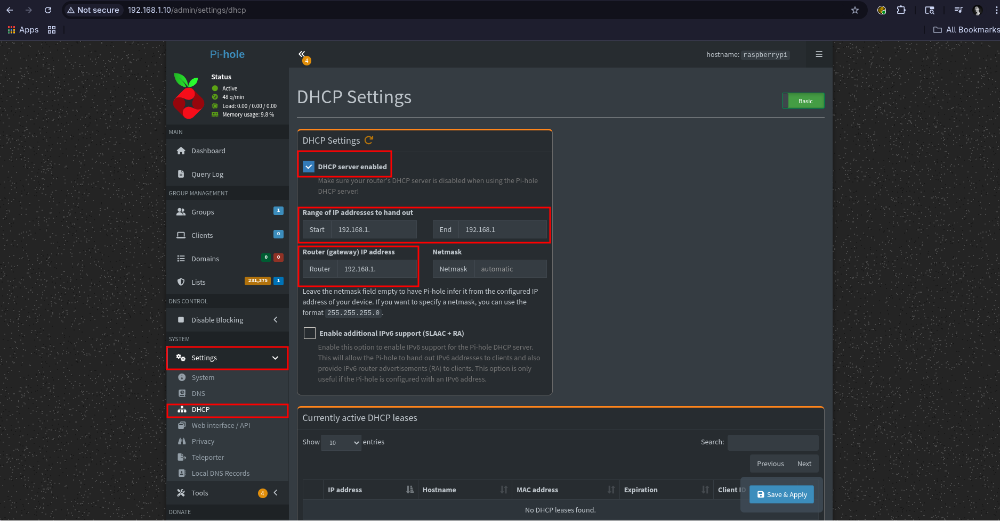
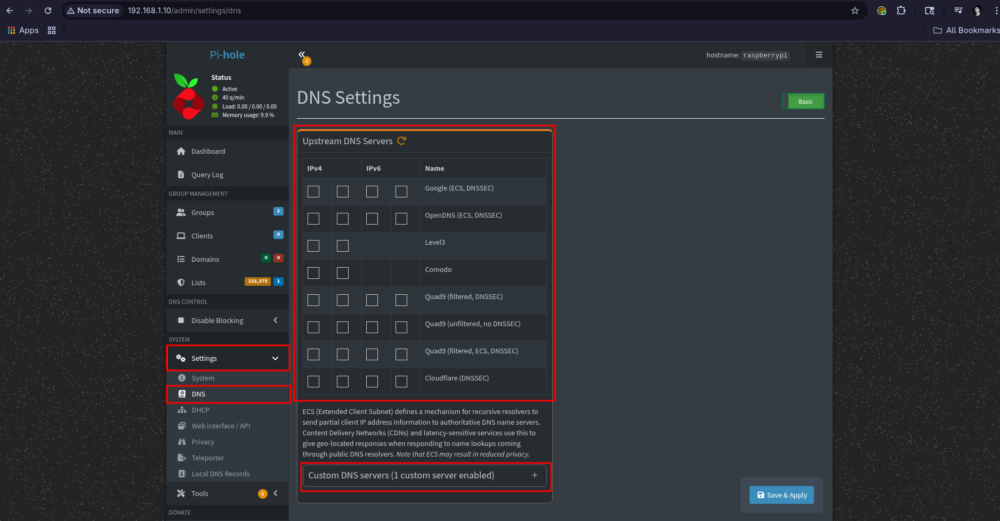

# DevOps Network Lab With Raspberry Pi 5


## Table of Contents

- [Project Overview](#project-overview)

- [Architecture](#)

- [Technologies Used](#)

- [Folder Structure](#)

- [Setup Instructions](#)

    - [Step 1: Raspberry Pi Setup](#)

    - [Step 2: Pi-hole DNS and DHCP](#)

    - [Step 3: WireGuard VPN](#)

    - [Step 4: SSH Tunnel Proxy](#)

    - [Step 5: Monitoring Stack](#)

- [Challenges & Fixes](#)
- [Screenshots](#)
- [Lessons Learned](#)
- [Future Improvements](#)

## Project Overview

This DevOps-oriented network lab was designed using a **Raspberry Pi 5** as a core network server. The objective was to build a fully automated, observable, and secure home lab implementing:

- DNS and ad-blocking via **Pi-hole**

- VPN gateway using **WireGuard**

- Network traffic monitoring via **Prometheus + Grafana**

- SSH tunneling for secure remote browsing

## Architecture:

The network lab architecture is composed of:

- Raspberry Pi 5 running Pi OS (GUI, SSH, and VNC enabled)

- Dockerized stack including Prometheus, Grafana, and Node Exporter

- WireGuard VPN server

- Pi-hole DNS server

- Clients: Desktop PC, iPhone, laptop

## Technologies Used

- Raspberry Pi OS (Debian-based)

- Docker & Docker Compose

- Prometheus

- Grafana

- Pi-hole

- WireGuard

- iptables

## Folder Structure

```ascii
network-lab-devops/
├─ configs/
│  ├─ unbound/
│  │  ├─ pi-hole.conf
├─ diagrams/
│  ├─ pi-hole-admin-panel.jpg
│  ├─ grafana.jpg
│  ├─ prometheus.jpg
├─ monitoring/
│  ├─ docker-compose.yml
│  ├─ prometheus.yml
├─ README.md
```

## Setup Instructions

### Step 1: Raspberry Pi Setup

```bash
# Flash Pi OS to SD card
# Enable SSH
sudo raspi-config # enable SSH and set hostname
```

### Step 2: Setup of DNS (Pi-hole + Unbound) + DHCP on Raspberry Pi 5

### Overview

| **Component** | **Role** |
| :------------ | :------- |
| Pi-hole       | DNS server with ad-blocking + DHCP support |
| dnsmasq       | Lightweight DHCP server (bundle with Pi-hole) |
| Unbound       | Recursive DNS resolver for privacy |

### Step 2.1: Install Pi-hole on the Raspberry Pi

Connect via SSH to your Pi first:

```bash
ssh pi@<your-pi-ip>
```

### Set Static IP Address on Raspberry Pi 5 

We are going to use the **NetworkManager** tool to setup a satatic IP for the **Raspberry Pi 5**

Run the following command:

```bash
sudo nmtui
```

This opens a **text-based GUI.** Do the following:

1. Edit a connection

2. Select your active connection (e.g., Wired connection 1 or your Wi-Fi)

3. Set the following:

    - **IPv4 Configuration:** `Manual`

    - **Address:** `192.168.1.10/24` (This is an exmaple but make sure you choose one outside your DHCP router pool so they don't overlap)

    - **Gateway:** `192.168.1.1` (Make sure you put your router IP here)

    - **DNS:** `127.0.0.1` (For local Pi-hole DNS)

4. Save

5. Back out and choose **Activate a connection**

    - Deactivate the current one

    - Reactivate it to apply changes

6. Confirm with:

```bash
ip a 
ping -c 2 8.8.8.8
```

### Install Pi-hole 

Run the official installer:

```bash
curl -sSL https://install.pi-hole.net | bash
```

During setup:

- Choose your active network interface (usually eth0 or wlan0)

- Make sure you have set the static IP for your Pi (important for DNS + DHCP stability)

- Choose an upstream DNS from the list (We will add out custom upstream DNS later)

- Enable query logging

- Select privacy mode for FTL (choose **Show everything**)

- Save the web admin password at the end

### Step 2.2: Configure Pi-hole Admin Panel

Access via browser:

```arduino
http://<your-pi-ip>/admin
```

### Enable DHCP

1. Go to: **Settings -> DHCP**

2. Enable the DHCP server

3. Set:

    - Range: `192.168.1.100 - 192.168.1.150` (This is an example, you have to make sure this IP pool range does not overlap with your Router's DHCP Pool IP address range)

    - Router (gateway): `192.168.1.1` (Make sure you put your router's IP here)

4. Save



### Step 2.3: Install and Configure Unbound (Recursive DNS)

### Install Unbound:

```bash
sudo apt update
sudo apt install unbound -y
```

### Create Pi-hole Unbound Config

Create the Unbound config directory if it doesn't exits:

```bash
sudo mkdir -p /etc/unbound/unbound.conf.d/
```

Then create the config file:

```bash
sudo vim /etc/unbound/unbound.conf.d/pi-hole.conf
```

Paste the following config:

```conf
server:
    verbosity: 0
    interface: 127.0.0.1
    port: 5335

    do-ip4: yes
    do-udp: yes
    do-tcp: yes

    root-hints: "/var/lib/unbound/root.hints"
    hide-identity: yes
    hide-version: yes
    harden-glue: yes
    harden-dnssec-stripped: yes
    use-caps-for-id: yes
    edns-buffer-size: 1232
    prefetch: yes
    qname-minimisation: yes
    rrset-roundrobin: yes
```

### Fetch the Latest Root DNS Hints File

This is the list of authoritative root DNS servers:

```bash
curl -o /var/lib/unbound/root.hints https://www.internic.net/domain/named.cache
```

### Restart & Enable Unbound

```bash
sudo systemctl restart unbound
sudo systemctl enable unbound
```

### Test Unbound Directly

```bash
dig pi-hole.net @127.0.0.1 -p 5335
```

You should get a valid response and it should not mention Cloudflare or Google (meaning it's Unbound).

### Step 2.4: Configure Pi-hole to Use Unbound

1. Go to: `Pi-hole Admin Panel -> Settings -> DNS`

2. **Uncheck** all upstream DNS providers

3. In **Custom 1 (IPv4)** add:

```bash
127.0.0.1#5335
```

4. Save




Now all DNS queries go:

> Device -> Pi-hole -> Unbound -> Root DNS servers
No 3rd party (like Cloudflare or Google) is involved anymore.

### Step 2.5: Flush DNS Cache

To make changes take effect cleanly:

```bash
pihole restartdns
```

### Step 3: Install WireGuard on the Pi

SSH into your Pi:

```bash
sudo apt update
sudo apt install wireguard -y
```

Enable IP forwarding:

```bash
sudo vim /etc/sysctl.conf
```

Uncomment or add:

```conf
net.ipv4.ip_forward=1 
```

Then apply it:

```bash
sudo sysctl -p
```

### Step 3.1: Generate WireGuard Keys


