# DevOps Network Lab With Raspberry Pi 5


## Table of Contents

- [Project Overview](#project-overview)

- [Architecture](#)

- [Technologies Used](#)

- [Folder Structure](#)

- [Setup Instructions](#)

    - [Step 1: Raspberry Pi Setup](#)

    - [Step 2: Pi-hole DNS and DHCP](#)

    - [Step 3: WireGuard VPN](#)

    - [Step 4: SSH Tunnel Proxy](#)

    - [Step 5: Monitoring Stack](#)

- [Challenges & Fixes](#)
- [Screenshots](#)
- [Lessons Learned](#)
- [Future Improvements](#)

## Project Overview

This DevOps-oriented network lab was designed using a **Raspberry Pi 5** as a core network server. The objective was to build a fully automated, observable, and secure home lab implementing:

- DNS and ad-blocking via **Pi-hole**

- VPN gateway using **WireGuard**

- Network traffic monitoring via **Prometheus + Grafana**

- SSH tunneling for secure remote browsing

## Architecture:

The network lab architecture is composed of:

- Raspberry Pi 5 running Pi OS (GUI, SSH, and VNC enabled)

- Dockerized stack including Prometheus, Grafana, and Node Exporter

- WireGuard VPN server

- Pi-hole DNS server

- Clients: Desktop PC, iPhone, laptop

## Technologies Used

- Raspberry Pi OS (Debian-based)

- Docker & Docker Compose

- Prometheus

- Grafana

- Pi-hole

- WireGuard

- iptables

## Folder Structure

```ascii
network-lab-devops/
├─ configs/
│  ├─ unbound/
│  │  ├─ pi-hole.conf
├─ diagrams/
│  ├─ pi-hole-admin-panel.jpg
│  ├─ grafana.jpg
│  ├─ prometheus.jpg
├─ monitoring/
│  ├─ docker-compose.yml
│  ├─ prometheus.yml
├─ README.md
```

## Setup Instructions

## Step 1: Raspberry Pi Setup

```bash
# Flash Pi OS to SD card
# Enable SSH
sudo raspi-config # enable SSH and set hostname
```

## Step 2: Setup of DNS (Pi-hole + Unbound) + DHCP on Raspberry Pi 5

### Overview

| **Component** | **Role** |
| :------------ | :------- |
| Pi-hole       | DNS server with ad-blocking + DHCP support |
| dnsmasq       | Lightweight DHCP server (bundle with Pi-hole) |
| Unbound       | Recursive DNS resolver for privacy |

### Step 2.1: Install Pi-hole on the Raspberry Pi

Connect via SSH to your Pi first:

```bash
ssh pi@<your-pi-ip>
```

### Set Static IP Address on Raspberry Pi 5 

We are going to use the **NetworkManager** tool to setup a satatic IP for the **Raspberry Pi 5**

Run the following command:

```bash
sudo nmtui
```

This opens a **text-based GUI.** Do the following:

1. Edit a connection

2. Select your active connection (e.g., Wired connection 1 or your Wi-Fi)

3. Set the following:

    - **IPv4 Configuration:** `Manual`

    - **Address:** `192.168.1.10/24` (This is an exmaple but make sure you choose one outside your DHCP router pool so they don't overlap)

    - **Gateway:** `192.168.1.1` (Make sure you put your router IP here)

    - **DNS:** `127.0.0.1` (For local Pi-hole DNS)

4. Save

5. Back out and choose **Activate a connection**

    - Deactivate the current one

    - Reactivate it to apply changes

6. Confirm with:

```bash
ip a 
ping -c 2 8.8.8.8
```

### Install Pi-hole 

Run the official installer:

```bash
curl -sSL https://install.pi-hole.net | bash
```

During setup:

- Choose your active network interface (usually eth0 or wlan0)

- Make sure you have set the static IP for your Pi (important for DNS + DHCP stability)

- Choose an upstream DNS from the list (We will add out custom upstream DNS later)

- Enable query logging

- Select privacy mode for FTL (choose **Show everything**)

- Save the web admin password at the end

### Step 2.2: Configure Pi-hole Admin Panel

Access via browser:

```arduino
http://<your-pi-ip>/admin
```

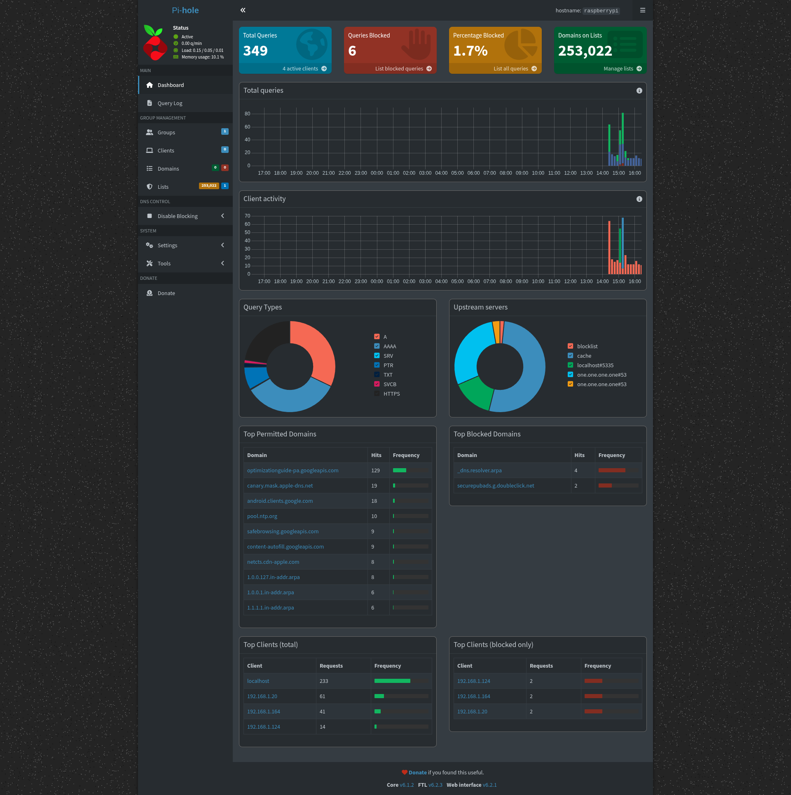

### Enable DHCP

1. Go to: **Settings -> DHCP**

2. Enable the DHCP server

3. Set:

    - Range: `192.168.1.100 - 192.168.1.150` (This is an example, you have to make sure this IP pool range does not overlap with your Router's DHCP Pool IP address range)

    - Router (gateway): `192.168.1.1` (Make sure you put your router's IP here)

4. Save


### Step 2.3: Install and Configure Unbound (Recursive DNS)

### Install Unbound:

```bash
sudo apt update
sudo apt install unbound -y
```

### Create Pi-hole Unbound Config

Create the Unbound config directory if it doesn't exits:

```bash
sudo mkdir -p /etc/unbound/unbound.conf.d/
```

Then create the config file:

```bash
sudo vim /etc/unbound/unbound.conf.d/pi-hole.conf
```

Paste the following config:

```conf
server:
    verbosity: 0
    interface: 127.0.0.1
    port: 5335

    do-ip4: yes
    do-udp: yes
    do-tcp: yes

    root-hints: "/var/lib/unbound/root.hints"
    hide-identity: yes
    hide-version: yes
    harden-glue: yes
    harden-dnssec-stripped: yes
    use-caps-for-id: yes
    edns-buffer-size: 1232
    prefetch: yes
    qname-minimisation: yes
    rrset-roundrobin: yes
```

### Fetch the Latest Root DNS Hints File

This is the list of authoritative root DNS servers:

```bash
curl -o /var/lib/unbound/root.hints https://www.internic.net/domain/named.cache
```

### Restart & Enable Unbound

```bash
sudo systemctl restart unbound
sudo systemctl enable unbound
```

### Test Unbound Directly

```bash
dig pi-hole.net @127.0.0.1 -p 5335
```

You should get a valid response and it should not mention Cloudflare or Google (meaning it's Unbound).

### Step 2.4: Configure Pi-hole to Use Unbound

1. Go to: `Pi-hole Admin Panel -> Settings -> DNS`

2. **Uncheck** all upstream DNS providers

3. In **Custom 1 (IPv4)** add:

```bash
127.0.0.1#5335
```

4. Save


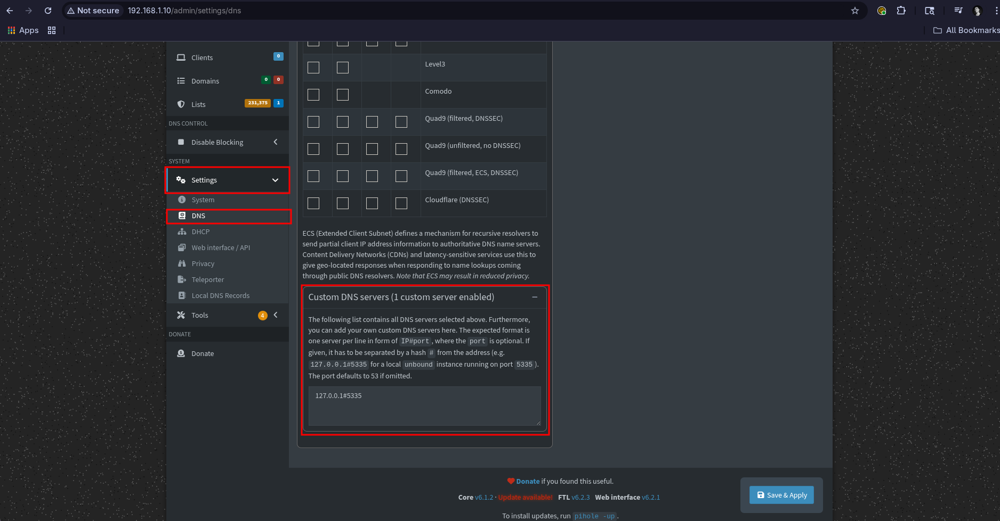

Now all DNS queries go:

> Device -> Pi-hole -> Unbound -> Root DNS servers
No 3rd party (like Cloudflare or Google) is involved anymore.

### Step 2.5: Flush DNS Cache

To make changes take effect cleanly:

```bash
pihole restartdns
```

## Step 3: Install WireGuard on the Pi

SSH into your Pi:

```bash
sudo apt update
sudo apt install wireguard -y
```

Enable IP forwarding:

```bash
sudo vim /etc/sysctl.conf
```

Uncomment or add:

```conf
net.ipv4.ip_forward=1 
```

Then apply it:

```bash
sudo sysctl -p
```

### Step 3.1: Generate WireGuard Keys

```bash
cd /etc/wireguard
sudo umask 077
sudo wg genkey  | sudo tee privatekey | sudo wg pubkey > publickey
```

```bash
sudo cat privatekey
sudo cat publickey
```

> Make sure to save these values, you will use them to build the config file

### Step 3.2: Create the WireGuard Server Config

```bash
sudo vim /etc/wireguard/wg0.conf
```

Paste the following configuration in the wg0.conf file:

```ini
[Interface]
PrivateKey = <PI_PRIVATE_KEY>
Address = 10.8.0.1/24
ListenPort = 51820
DNS = 192.168.1.10

PostUp = iptables -A FORWARD -i %i -j ACCEPT; iptables -A FORWARD -o %i -j ACCEPT; iptables -t nat -A POSTROUTING -o eth0 -j MASQUERADE

PostDown = iptables -D FORWARD -i %i -j ACCEPT; iptables -D FORWARD -o %i -j ACCEPT; iptables -t nat -D POSTROUTING -o eth0 -j MASQUERADE
```

Replace:

- `<PI_PRIVATE_KEY>` with the output from `sudo cat /etc/wireguard/privatekey`

- `eth0` if needed with `wlan0` if you're using Wi-Fi

Save and exit.

### Set Correct Permissions

WireGuard requires the config file to be readable only by root:

```bash
sudo chmod 600 /etc/wireguard/wg0.conf
```

### Install `resolvconf`

```bash
sudo apt install resolvconf -y
```

### Step 3.3: Start WireGuard

```bash
sudo systemctl start wg-quick@wg0
sudo systemctl enable wg-quick@wg0
```

Check Status:

```bash
sudo wg 
```

### Step 3.4: Set Up iPhone WireGuard Client

Now let's create a configuration you can use to connect your iPhone securely into this network.

### Generate iPhone Keys on the Pi

```bash
cd /etc/wireguard
umask 077
wg genkey | tee iphone_privatekey | wg pubkey > iphone_publickey
```

Now check the keys:

```bash
cat iphone_privatekey
cat iphone_publickey
```

### Add iPhone to Server (`wg0.conf`)

Open the server config:

```bash
sudo vim /etc/wireguard/wg0.conf
```

### Add the following to the bottom of wg0.conf file:

```ini
[Peer]
PublicKey = <IPHONE_PUBLIC_KEY>
AllowedIPs = 10.8.0.2/32
```

Replace `<IPHONE_PUBLIC_KEY>` with the key from the previous step.

Save and exit.

Restart service:

```bash
sudo systemctl restart wg-quick@wg0
```

### Create iPhone Client Config

Use the [WireGuard app](https://apps.apple.com/us/app/wireguard/id1441195209)

This is what you'll import into the **WireGuard IOS app:**

```ini
[Interface]
PrivateKey = <IPHONE_PRIVATE_KEY>
Address = 10.8.0.2/24
DNS = 192.168.1.10

[Peer]
PublicKey = <PI_PUBLIC_KEY>
Endpoint = <YOUR_PUBLIC_IP>:51820
AllowedIPs = 0.0.0.0/0
PersistentKeepalive = 25
```

> Replace:
    - "`<IPHONE_PRIVATE_KEY>` = the key you just generated"
    - "`<PI_PUBLIC_KEY>` = server's public key (`sudo cat /etc/wireguard/publickey`)"
    - "`<YOUR_PUBLIC_IP>` = use your home router's public IP (you can find it at [whatismyipaddress](https://whatismyipaddress.com/))"

### Step 3.5: Generate QR Code for Import 

Install QR generator:

```bash
sudo apt install qrencode -y
```

Then:

```bash
qrencode -t ansiutf8 < iphone.conf
```

### 3.6: Final Validation

- Connect iPhone via WireGuard

- Visit a website (should route through Pi-hole. check logs)

- Visit `http://pi.hole/admin` from iPhone (VPN should route it)

### Important:

- You **must set up port forwarding** on your router to forward `UDP` port **51820** to the **Raspberry Pi's local IP** (e.g., 192.168.1.X).

- Without this, external clients cannot reach your Pi through the firewall/router.

## Step 4: Install Monitoring (Prometheus + Grafana)

Steps:

1. Install Prometheus + Grafana (via Docker)

2. Monitor:

    - Pi-hole DNS stats

    - System metrics (CPU, RAM, network)

3. Build dashboards in Grafana

### Step 4.1: Write the `docker-compose.yml` file

```yaml
services:
  prometheus:
    image: prom/prometheus
    container_name: prometheus
    volumes:
      - ./prometheus.yml:/etc/prometheus/prometheus.yml
    ports:
      - "9090:9090"         # Correct port for Prometheus

  grafana:
    image: grafana/grafana
    container_name: grafana
    ports:
      - "3000:3000"
    restart: unless-stopped

  node_exporter:
    image: prom/node-exporter
    container_name: node_exporter
    ports:
      - "9100:9100"         # Correct port for node_exporter
    restart: unless-stopped


  pihole-exporter:
    image: ekofr/pihole-exporter:latest
    container_name: pihole_exporter
    restart: unless-stopped
    ports:
      - "9617:9617"        # Correct port for pihole-exporter
    environment:
      - PIHOLE_HOSTNAME=http://192.168.1.10:80
      - PIHOLE_PASSWORD=6q3AUQfr
```

### Step 4.2: Create `promethus.yml`

This will collect metrics from:

- **node_exporter** (basic Pi stats)

- **Pi-hole exporter**

```yaml
global:
  scrape_interval: 15s

scrape_configs:
  - job_name: 'node'
    static_configs:
      - targets: ['node_exporter:9100']

  - job_name: 'pihole'
    static_configs:
      - targets: ['pihole_exporter:9617']
```

### Step 4.3: Install `node_exporter` on the Pi

```bash
sudo apt update
sudo apt install -y prometheus-node-exporter
sudo systemctl enable prometheus-node-exporter
sudo systemctl start prometheus-node-exporter
```

Verify that it's running:

```bash
systemctl status prometheus-node-exporter
```

> Make sure it's listening on port `9100`

```bash
curl http://localhost:9100/metrics
```

### Step 4.4: Launch Everything

Navigate to the `monitoring/` directory and run:

```bash
docker-compose up -d
```

Then go to:

- `http://<your-pi-ip>:3000`

- Login: admin / admin -> Set a new password

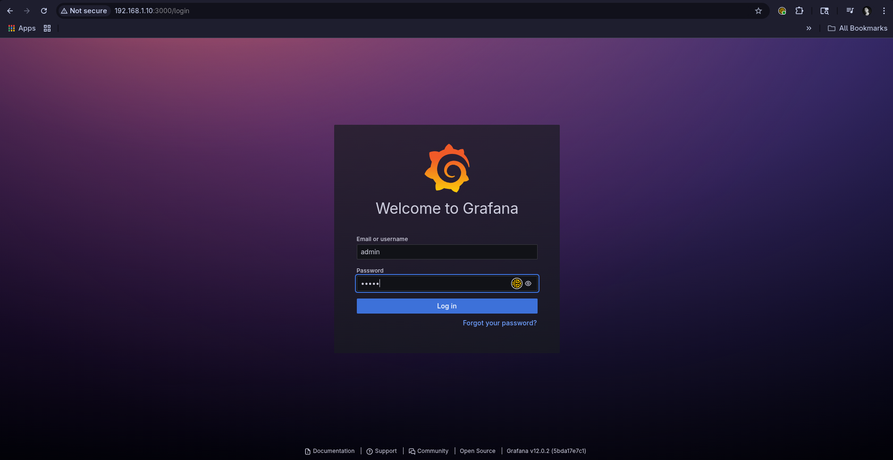

- `http://<your-pi-ip>:9090`

- Access to Prometheus dashboard

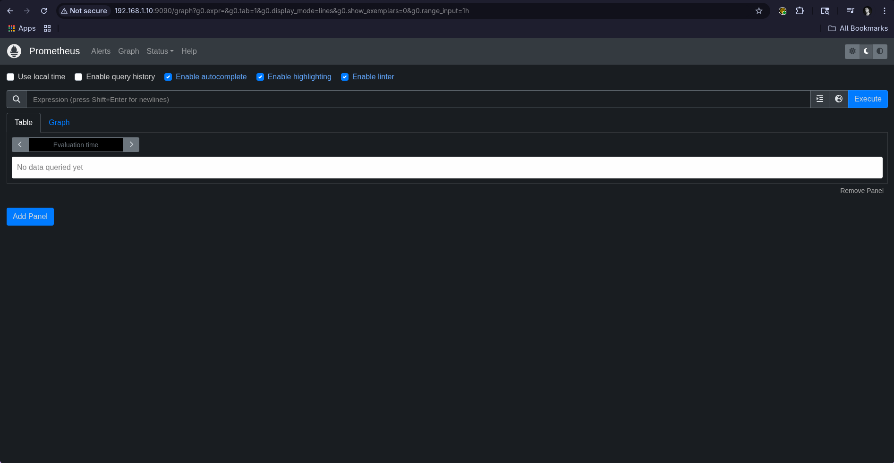

**Confirm in Prometheus:**

Go to `http://<pi-ip>:9090` and search the following metrics:

- `node_cpu_seconds_total`

- `node_memory_MemAvailable_bytes`

- `node_filesystem_avail_bytes`

- `node_temperature_sensor`

You should be able to get values, this means it's working!

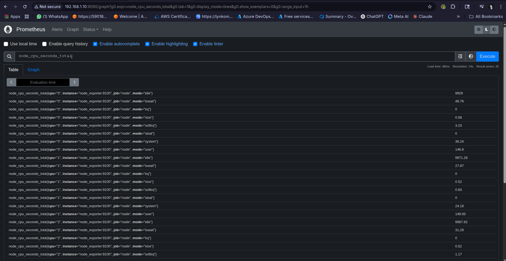

Also go to `Status tab -> Targets` you should be able to see the status of `node_exporter` and `pihole` endpoints **UP**:

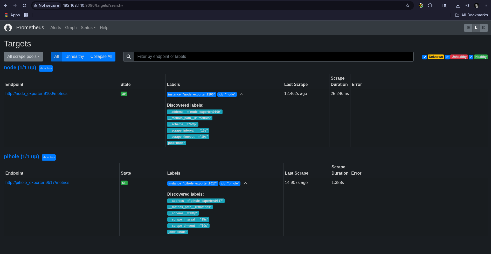

### Step 4.5: Add a Grafana Dashboard

Instead of creating one from scratch, let's import a ready-made dashboard:

1. Go to Graphana -> Data sources -> Add new data source

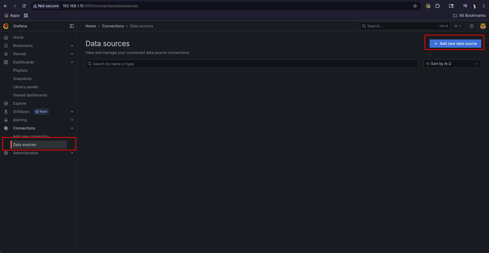

2. Select the Prometheus data source

    - **Name:** `Prometheus`

    - **Connection:** `http://prometheus:9090`

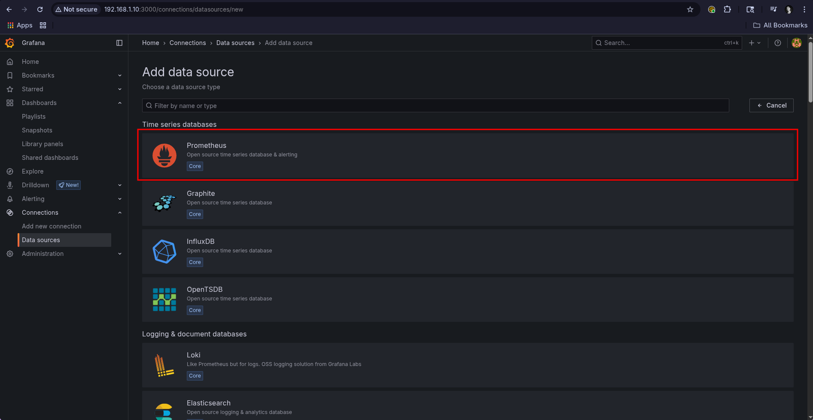

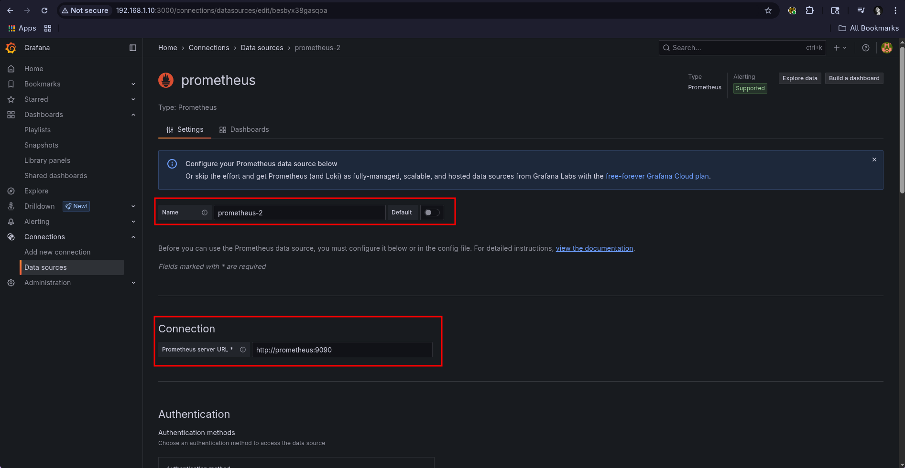

3. Click Save & test

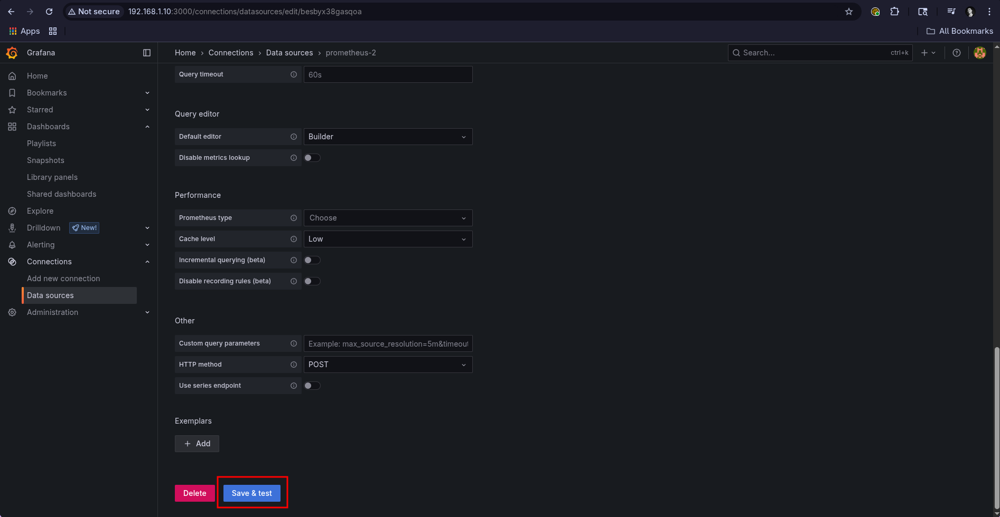

4. Go to Dashboards -> Click New -> Select Import 

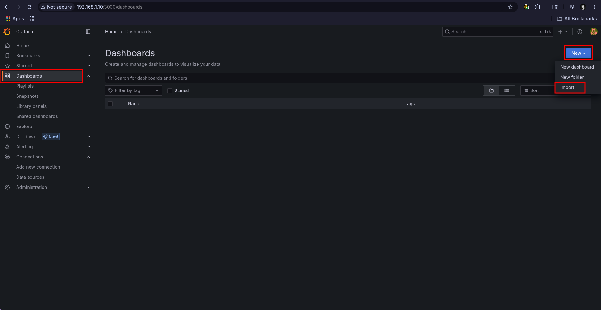

5. Use Dashboard ID `1860` (Node Exporter Full) and click on `Load`

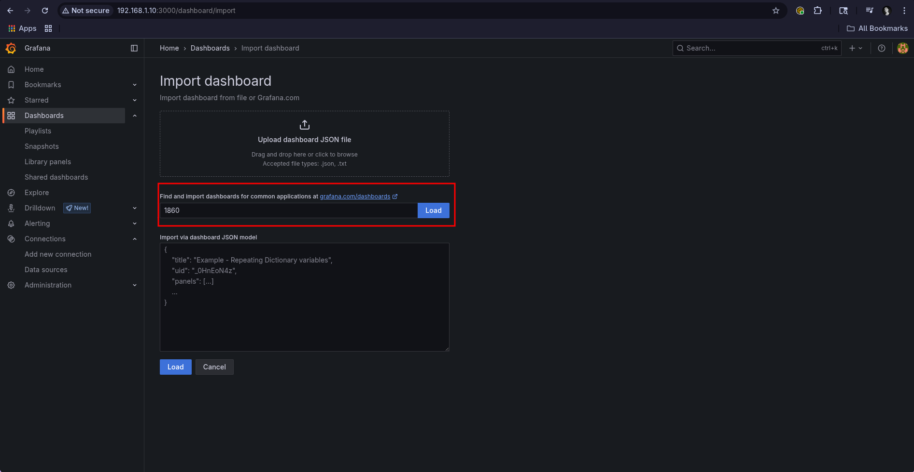

6. In the prometheus field click the dropdown and select the Prometheus data source we configured previously

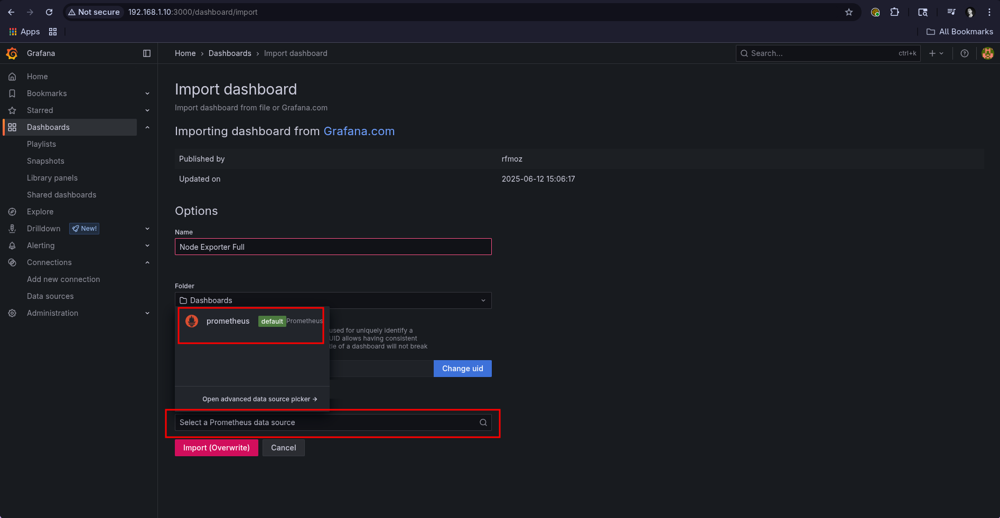

7. Click Import 

**Grafana Dashboard Screenshot**


You can now monitor:

- CPU/Load averages

- RAM and disk usage

- Network interfaces

- Uptime and system services

## Challenges & Fixes

| **Issue** | **Resolution** |
| :-------- | :------------- |
| WireGuard `wg0` failed to start | Missing resolvconf installation |
| VPN not routing public traffic | Likely NAT/ISP limitation, unable to port forward effectively |
| Pi became unreachable after IP passthrough | Reverted setup |
| Node Exporter port in use | Found rogue process with `lsof -i :9100` and killed it |
| Prometheus not scraping data | Missing space in `- targets:` key in YAML |

## Lessons Learned

- WireGuard is powerful but requeries careful NAT configuration

- Docker Compose simplifies stack management significantly

- Prometheus and Grafana together give excellent visibility

- SSH tunnel proxying is a very viable backup to full VPN

- iptables rules must be crafted carefully to avoid network issues

## Improvements

- Implement full DNS hijack to make Pi-hole transparent to LAN

- Experiment with Tailscale for easier VPN overlay

## 📫 Contact

This project was developed by [Jorge Bayuelo](https://github.com/JORGEBAYUELO)

Feel free to connect with me on [LinkedIn](https://www.linkedin.com/in/jorge-bayuelo/)!
